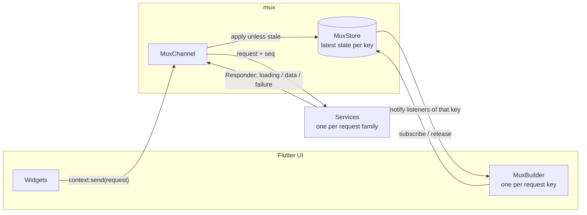
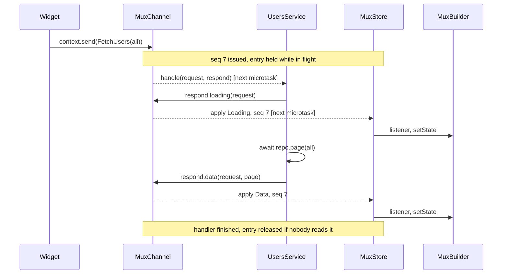
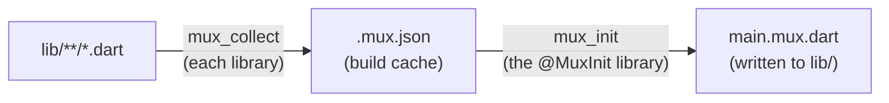

# flutter_mux

Request-keyed state management for Dart and Flutter.

Widgets **send typed requests** over **one channel**. **Services** answer them.
A **retained cache** keeps the latest state for each request, and **only the
widgets reading that request rebuild**. Services and their dependencies are
wired by **code generation**, so there is no hand-written glue.

> **Status: pre-release `0.1.0-dev.1`.** Not published to pub.dev yet. The API
> may change before `0.1.0`.

- [The idea](#the-idea)
- [Packages](#packages)
- [Quick start](#quick-start)
- [How it works](#how-it-works)
  - [Architecture](#architecture)
  - [Life of a request](#life-of-a-request)
  - [Requests and keys](#requests-and-keys)
  - [AsyncState](#asyncstate)
  - [The cache](#the-cache)
  - [Sequencing: stale responses are dropped](#sequencing-stale-responses-are-dropped)
  - [Eviction](#eviction)
  - [Errors](#errors)
  - [Timing](#timing)
  - [Rebuild scope](#rebuild-scope)
  - [Code generation](#code-generation)
- [Patterns](#patterns)
- [Testing](#testing)
- [API overview](#api-overview)
- [Repository layout](#repository-layout)
- [Development](#development)
- [Releasing](#releasing)
- [License](#license)

## The idea

Most screens follow the same loop: ask for something, show a spinner, show the
result or an error, refresh later. flutter_mux turns that loop into one model:

1. **A request is a value.** `FetchUsers(UserFilter.active)` says what you want,
   and its **key** (`(UsersList, UserFilter.active)`) says where the answer lives.
   There are no string tags and no registry.
2. **There is one channel.** Every widget sends requests to it, and every
   service answers through it.
3. **Answers are cached per key.** A widget that subscribes later gets the
   current state immediately. Two widgets reading the same key share one entry.
4. **Services are plain classes** with an exhaustive `switch` over a sealed request
   family. Errors become states, never exceptions in the UI.
5. **Wiring is generated.** Annotate the widget that uses a service, and
   `build_runner` creates the channel, builds the service with its
   dependencies, and routes its requests to it.

## Packages

| Package | Role | Add as |
|---|---|---|
| [`mux`](packages/mux) | Pure-Dart core: `Request`, `AsyncState`, `MuxChannel`, `MuxStore`, `MuxService`, annotations. No Flutter import. | dependency |
| [`flutter_mux`](packages/flutter_mux) | Widgets: `MuxApp`, `MuxBuilder`, `context.send`. Re-exports `mux`. | dependency |
| [`mux_generator`](packages/mux_generator) | `build_runner` builders that generate `$createMuxChannel`. Development time only. | dev dependency |

A Flutter app's `pubspec.yaml`:

```yaml
dependencies:
  flutter_mux: ^0.1.0-dev.1
  mux: ^0.1.0-dev.1        # the generated file imports package:mux directly

dev_dependencies:
  build_runner: ^2.15.1
  mux_generator: ^0.1.0-dev.1
```

The generator lives in its own package so its heavy build-time dependencies
(`analyzer`, `build`, `source_gen`) never enter your app's runtime dependencies.
freezed and json_serializable split their packages the same way.

## Quick start

This builds a list of users filtered by status. The complete version, with
pagination and pull-to-refresh, is in [`example/`](example).

### 1. Define requests

A request declares its response type `T` and a `key`. Put the requests of one
feature in a sealed family so services can `switch` over them exhaustively.

```dart
// lib/requests.dart
import 'package:mux/mux.dart';

sealed class AppRequest<T> extends Request<T> {
  const AppRequest();
}

/// Key tag, so several request classes can share one cache entry.
abstract final class UsersList {}

final class FetchUsers extends AppRequest<UserPage> {
  const FetchUsers(this.filter);

  final UserFilter filter;

  @override
  Object get key => (UsersList, filter);
}
```

### 2. Provide dependencies

Annotate anything a service needs with `@MuxProvide()`. The generator creates it
and passes it to service constructors by type.

```dart
// lib/users_repo.dart
@MuxProvide()
final class UsersRepo {
  Future<UserPage> page(UserFilter filter, {int cursor = 0}) async => ...;
}
```

### 3. Write a service

A service extends `MuxService<R>`, where `R` is the whole request family it
handles. It answers through the `Responder`.

```dart
// lib/users_service.dart
final class UsersService extends MuxService<AppRequest<Object?>> {
  UsersService(this._repo); // UsersRepo is injected

  final UsersRepo _repo;

  @override
  Future<void> handle(AppRequest<Object?> request, Responder respond) async {
    switch (request) {
      case FetchUsers r:
        respond.loading(r);
        respond.data(r, await _repo.page(r.filter));
    }
  }
}
```

You don't need `try`/`catch`: a throw becomes a `Failure` state for that request.

### 4. Build the screen

Annotate the widget with the service it uses. Send requests with `context.send`,
and render one request's state with `MuxBuilder`.

```dart
// lib/users_screen.dart
@WithService(UsersService)
class UsersScreen extends StatefulWidget {
  const UsersScreen({super.key});

  @override
  State<UsersScreen> createState() => _UsersScreenState();
}

class _UsersScreenState extends State<UsersScreen> {
  var _filter = UserFilter.all;

  @override
  void initState() {
    super.initState();
    context.send(FetchUsers(_filter));
  }

  @override
  Widget build(BuildContext context) {
    return MuxBuilder<UserPage>(
      request: FetchUsers(_filter),
      builder: (context, state) => switch (state) {
        Idle() || Loading(previous: null) => const CircularProgressIndicator(),
        Loading(:final UserPage previous) => UserList(previous, refreshing: true),
        Data(:final value) => UserList(value),
        Failure(:final error) => Text('Failed: $error'),
      },
    );
  }
}
```

### 5. Mark the entry point and generate

```dart
// lib/main.dart
import 'package:flutter/material.dart';
import 'package:flutter_mux/flutter_mux.dart';

import 'main.mux.dart'; // generated

@MuxInit()
void main() => runApp(
  const MuxApp(
    create: $createMuxChannel,
    child: MaterialApp(home: UsersScreen()),
  ),
);
```

```bash
dart run build_runner build
```

`build_runner` writes `lib/main.mux.dart`. Run it again after adding or changing
annotations, or keep `dart run build_runner watch` running.

## How it works

### Architecture



- **`MuxChannel`** carries requests down to services and responses back up.
- **`MuxStore`** holds one entry per request key: the latest `AsyncState`, a
  sequence number, a subscriber count, and a count of requests still running.
- **`MuxService`s** do the work, such as network or database calls.
- **`MuxBuilder`** subscribes to one key and rebuilds itself when that key
  changes. Nothing above it rebuilds.

### Life of a request



1. **`send`** registers the dispatch: it gives the request the next sequence number
   and marks its key as having a request in flight. Then it queues the request.
2. **The bound handler runs** in a later microtask, without being awaited, so a
   slow request never delays the next one.
3. **Each `respond.*` call** puts a response envelope (key, seq, state) on the
   response stream.
4. **The store applies the response** unless it is stale (see
   [Sequencing](#sequencing-stale-responses-are-dropped)), then calls that key's
   listeners synchronously.
5. **`MuxBuilder`'s listener calls `setState`**, so only that widget rebuilds.
6. **When the handler finishes,** the in-flight mark is cleared. If nobody is
   subscribed, the entry is evicted.

### Requests and keys

```dart
final class FetchUsers extends AppRequest<UserPage> {
  const FetchUsers(this.filter);
  final UserFilter filter;

  @override
  Object get key => (UsersList, filter);
}
```

- **The key is the cache identity.** Records compare by value, so
  `FetchUsers(UserFilter.all)` created twice maps to the same entry. Every field
  in the key must implement `==` and `hashCode` (enums, strings, numbers,
  records and `const` objects all do).
- **Different request classes can share a key.** In the example,
  `FetchUsers(filter)` and `LoadMoreUsers(filter)` both use
  `(UsersList, filter)`, so a load-more appends to the list the first fetch
  created. Requests that share a key must declare the same `T`.
- **`keepAlive`** keeps an entry after its last subscriber leaves. Use it for
  app-wide data such as a config or the current user:

  ```dart
  @override
  bool get keepAlive => true;
  ```

### AsyncState

Every key's state is one of four cases:

```dart
sealed class AsyncState<T> {}
final class Idle<T>    // nothing requested yet
final class Loading<T> // in flight; `previous` holds the last value, if any
final class Data<T>    // `value`
final class Failure<T> // `error`, `stackTrace`; `previous` holds the last value
```

`Loading` and `Failure` carry `previous`, so a refresh doesn't blank the screen.
The list stays visible with a progress indicator, and a failed refresh can show
an error banner above the old data. `state.latest` returns the most recent value
from any case.

Because `AsyncState` is sealed, a `switch` over it must handle every case, and
the compiler tells you when one is missing.

### The cache

`MuxStore` retains the **latest state per key**, not a stream of events.

- **`store.read(request)`** returns the current state, or `Idle` if nothing is
  cached.
- **`store.subscribe(request)`** returns a `MuxLease` whose `state` is already
  up to date. A widget built after the data arrived shows it immediately, with
  no refetch and no spinner.
- **Listeners are per key.** A response for `FetchUsers(active)` notifies only
  the leases on that key.

`MuxBuilder` does all of this for you. You only use leases directly in pure-Dart
code and tests.

### Sequencing: stale responses are dropped

Every `send` gets a number from one counter that only goes up. A response is
applied only if its number is **not older than the one already applied** for
that key.

Here is a user pulling to refresh twice, where the first request is slower:

| Step | Event | Applied seq | State shown |
|---|---|---|---|
| 1 | refresh #1 sent (seq 1) | none | Idle |
| 2 | refresh #2 sent (seq 2) | none | Idle |
| 3 | #1 responds `loading` | 1 | Loading |
| 4 | #2 responds `loading` | 2 | Loading |
| 5 | #2 responds `data(new)` | 2 | Data(new) |
| 6 | #1 responds `data(old)`, but 1 < 2, so it's **dropped** | 2 | Data(new) |

Without this, the slower response would overwrite fresh data with stale data.
The same rule makes a refresh win over a load-more that is still running.

One more guard: when a key's entry is created (or re-created after eviction), it
starts above every number issued so far. A late response from a request sent
before the entry existed can never land on it.

### Eviction

Entries are freed automatically. An entry is evicted when **all** of these hold:

- **no subscribers:** no mounted `MuxBuilder` and no unreleased lease reads it,
- **no request in flight:** no handler for that key is still running, and
- **not keepAlive:** no request for that key has set `keepAlive`.

Eviction is **deferred until the current synchronous work finishes** (one
microtask), and it is cancelled if the key gains a subscriber in the meantime.

What this means in practice:

| Situation | Result |
|---|---|
| Pop a screen whose data has loaded | Its key is evicted. Opening it again starts fresh. |
| Pop a screen while its request is still running | The entry stays until the request finishes, then is evicted. |
| Switch a filter chip: `setState` then `send` | The new key is held by its in-flight request, so the rebuilt `MuxBuilder` still receives the response. |
| A widget rebuilds with the same key (unsubscribe and resubscribe in one frame) | Nothing is evicted and the cached value stays. |
| Two screens read the same key, and one is popped | The entry stays for the other screen. |
| `keepAlive` request | Never evicted. |

### Errors

- **A handler that throws,** synchronously or after an `await`, produces a
  `Failure` for its request, with `previous` set to the last value. The channel
  keeps handling other requests.
- **Errors never travel as stream errors.** The UI always receives a normal
  state, so one failing request can't break a subscription.
- **A handler can report a failure itself** with
  `respond.failure(request, error, stackTrace)`.
- **Responding to the wrong key** (a request other than the one being handled)
  throws an `ArgumentError`, which becomes a `Failure` for the original request.
- **A request no generated service handles** fails with a `StateError`, which
  arrives as a `Failure` in the UI.

### Timing

Requests and responses are delivered **one microtask later**, not inline.

- **This is safe to call anywhere.** A common pattern is `send` in `initState`.
  If responses applied immediately, that `send` could call `setState` on other
  widgets while Flutter is still building and trigger "setState() called during
  build". The microtask hop prevents that.
- **In the running app, you never notice.** A response calls `setState`, and
  the next frame shows it.
- **In widget tests, you pump.** A test controls frames. A response lands after
  `tester.pump()` has already decided whether to draw a frame, so pump once more
  (or use `pumpAndSettle`). See [Testing](#testing).

### Rebuild scope

- **`MuxApp`** creates the channel once and puts it in a `MuxScope`.
- **`MuxScope`** is an `InheritedWidget` that never notifies dependents. Looking
  it up (`context.send`, `MuxBuilder`) registers no dependency, so **nothing
  rebuilds from the top of the tree.**
- **`MuxBuilder<T>`** subscribes to its request's key:
  - It subscribes when first mounted.
  - When its `request` changes to a different key, it subscribes to the new key
    before releasing the old one.
  - It releases the key in `dispose`.

  Its listener calls `setState`, so only that builder's subtree rebuilds.

A screen with a header, filter chips and a list rebuilds **only the list** when
new data arrives.

### Code generation

`mux_generator` creates the channel for you, so you never call `bind` or
construct services by hand.

#### What you annotate

| Annotation | Put it on | Meaning |
|---|---|---|
| `@WithService(UsersService)` | A widget class | This widget uses `UsersService`. Include it in the channel. |
| `@MuxProvide()` | Any class (repositories, API clients) | Create this class and inject it into constructors by type. |
| `@MuxInit()` | One function, usually `main` | Write the generated file next to this file. |

A widget can carry several `@WithService` annotations. A service referenced from
many widgets is still created once.

#### What gets generated

For the quick start, `lib/main.mux.dart` contains:

```dart
mux.MuxChannel<mux.Request<Object?>> $createMuxChannel({i0.UsersRepo? usersRepo}) {
  final $usersRepo = usersRepo ?? i0.UsersRepo();
  final $usersService = i1.UsersService($usersRepo);

  return mux.MuxChannel<mux.Request<Object?>>()..bind(
    (request, respond) => switch (request) {
      final i2.AppRequest<Object?> r => $usersService.handle(r, respond),
      _ => throw StateError('No @WithService service handles ${request.runtimeType}'),
    },
  );
}
```

- **Dependencies are created first.** Providers are built before the services
  that need them, and only if some service needs them.
- **Every provider becomes an optional parameter**, named after the class in
  lowerCamelCase. Tests use it to pass in fakes.
- **Only required constructor parameters are injected.** Optional parameters keep
  their defaults. Injected parameters must be non-nullable class types.
- **Services can depend on other services.**
- **Requests are routed by family.** Each service receives every request of its
  `R`.

#### How the generator runs



1. **`mux_collect`** reads each library that mentions `WithService` or
   `MuxProvide`. For each service it records the request family (`R`) and the
   constructor parameter types; for each provider, its constructor parameters.
   The result is a small `.mux.json` file in the build cache, not your source
   tree.
2. **`mux_init`** runs on the library that has `@MuxInit`. It collects every
   `.mux.json` under `lib/`, orders creation by dependency, and writes
   `<file>.mux.dart` next to that library.

#### Build errors

Wiring mistakes fail the build with a message naming the class:

| Problem | Message (abridged) |
|---|---|
| `@WithService` names a class that isn't a `MuxService` | `X is used in @WithService but does not extend MuxService.` |
| A service handles a partial family, e.g. `MuxService<AppRequest<User>>` | `X must handle a whole request family, e.g. MuxService<AppRequest<Object?>>` |
| A service or provider has no unnamed constructor, or is abstract | `X needs an unnamed constructor so mux can create it.` |
| A constructor parameter type isn't provided | `UsersService needs UsersRepo (parameter repo), but no @MuxProvide class or @WithService service provides it.` |
| Dependencies form a cycle | `Dependency cycle: A -> B -> A.` |
| Two services handle overlapping families | `... handle overlapping requests; each request family needs exactly one service.` |

#### Limits

- **Annotations go on declarations** (classes and functions), not on widget
  instances inside `build()`. This is a Dart language rule.
- **Annotated classes must live under `lib/`.**
- **Re-run `build_runner`** after changing annotations or constructors.

## Patterns

### Pull to refresh

Send the same request again. `Loading(previous: …)` keeps the list visible, and
[sequencing](#sequencing-stale-responses-are-dropped) makes the newest response
win.

```dart
RefreshIndicator(
  onRefresh: () async => context.send(FetchUsers(filter)),
  child: UserList(page),
)
```

### Pagination

Give load-more the list's key so pages append to one entry. The service reads
the current value and only pages from settled data. That makes duplicate
scroll triggers harmless, and lets a refresh that is still running take
priority.

```dart
final class LoadMoreUsers extends AppRequest<UserPage> {
  const LoadMoreUsers(this.filter);
  final UserFilter filter;

  @override
  Object get key => (UsersList, filter); // same key as FetchUsers
}

Future<void> _loadMore(LoadMoreUsers request, Responder respond) async {
  final current = respond.current(request);
  if (current is! Data<UserPage>) return;          // loading or failed: skip
  final cursor = current.value.nextCursor;
  if (cursor == null) return;                      // no more pages
  respond.loading(request);                        // keeps the list as `previous`
  final next = await _repo.page(request.filter, cursor: cursor);
  respond.data(request, UserPage([...current.value.users, ...next.users],
      nextCursor: next.nextCursor));
}
```

### Filters

Change the request in `setState` and send it. `MuxBuilder` moves to the new key,
and the old filter's entry is evicted once nothing reads it.

```dart
void _select(UserFilter filter) {
  setState(() => _filter = filter);
  context.send(FetchUsers(filter));
}
```

### Navigation

A pushed screen reading a different key is its own entry, and popping it evicts
that entry. Screens reading the same key share it. For data that should survive
navigation, set `keepAlive`.

## Testing

### Unit tests (pure Dart)

Bind a service to a channel directly, and let queued work run with
`pumpEventQueue()` from `package:test`.

```dart
test('loads users', () async {
  // A fake that answers without delay, so one pumpEventQueue() is enough.
  final channel = MuxChannel<AppRequest<Object?>>()
    ..bind(UsersService(FakeUsersRepo()).handle);
  addTearDown(channel.close);

  final lease = channel.store.subscribe(const FetchUsers(UserFilter.all));
  channel.send(const FetchUsers(UserFilter.all));
  await pumpEventQueue();

  expect(lease.state, isA<Data<UserPage>>());
});
```

See [`packages/mux/test`](packages/mux/test) for sequencing and eviction tests.

### Widget tests

Pass fakes through the generated function's optional parameters:

```dart
testWidgets('shows users', (tester) async {
  await tester.pumpWidget(
    MuxApp(
      create: () => $createMuxChannel(usersRepo: FakeUsersRepo()),
      child: const MaterialApp(home: UsersScreen()),
    ),
  );
  await tester.pump(); // request dispatched, Loading applied
  await tester.pump(); // frame drawn

  expect(find.byType(CircularProgressIndicator), findsOneWidget);
});
```

- **Create the channel inside the test.** `testWidgets` runs in a FakeAsync zone.
  A channel created in `setUp` lives outside that zone, and its events never
  arrive. `MuxApp(create: …)` creates it at the right time.
- **Pump twice, or use `pumpAndSettle()`.** Responses land a microtask after
  `pump` checks for a frame (see [Timing](#timing)). If an animation runs
  forever, such as a spinner, `pumpAndSettle` never returns, so use
  `pump(duration)` instead.

The example's [widget tests](example/test/users_screen_test.dart) cover
pagination, filter switching and eviction on pop.

## API overview

| Symbol | Package | Purpose |
|---|---|---|
| `Request<T>` | mux | Base class for requests: `key`, `keepAlive`. |
| `AsyncState<T>` | mux | `Idle`, `Loading`, `Data`, `Failure`; `latest`. |
| `MuxService<R>` | mux | `handle(R request, Responder respond)`. |
| `Responder` | mux | `loading`, `data`, `failure`, `current`. |
| `MuxChannel<R>` | mux | `send`, `bind`, `close`, `store`. |
| `MuxStore` | mux | `read`, `subscribe`. |
| `MuxLease<T>` | mux | `state`, `addListener`, `removeListener`, `release`. |
| `@WithService`, `@MuxProvide`, `@MuxInit` | mux | Wiring annotations read by `mux_generator`. |
| `MuxApp` | flutter_mux | Creates the channel once, closes it on dispose. |
| `MuxBuilder<T>` | flutter_mux | Rebuilds for one request key. |
| `context.send` | flutter_mux | Sends a request on the nearest channel. |
| `MuxScope` | flutter_mux | The inherited widget behind `MuxApp`; `storeOf(context)`. |
| `$createMuxChannel` | generated | The app's wired channel, with optional provider overrides. |

## Repository layout

```text
packages/
  mux/              pure-Dart core
    lib/src/        request, async_state, channel, store, service, annotations
    test/           channel and pagination tests
  flutter_mux/      MuxApp, MuxScope, MuxBuilder
  mux_generator/    build_runner builders (collect_builder, init_generator)
example/            paginated, filterable user list with pull-to-refresh
.github/workflows/  GitHub releases and pub.dev publishing
```

## Development

Requires Dart 3.10+ and [melos](https://melos.invertase.dev).

```bash
dart pub global activate melos
flutter pub get
melos run generate      # build_runner in packages using mux_generator
melos run test:dart     # mux, mux_generator
melos run test:flutter  # flutter_mux, example
```

This is a [pub workspace](https://dart.dev/tools/pub/workspaces): all packages
share one dependency resolution, and packages that depend on each other use
their local copies.

## Releasing

The packages share one version (melos fixed mode), and each package gets its own
tag, such as `mux-v0.1.0-dev.1`. Commit messages follow
[Conventional Commits](https://www.conventionalcommits.org) (`feat:`, `fix:`, …),
which melos uses to pick the next version and write the changelogs.

```bash
melos version --prerelease   # e.g. 0.1.0-dev.1 -> 0.1.0-dev.2 (commits and tags)
melos version --graduate     # e.g. 0.1.0-dev.2 -> 0.1.0
```

Pushing a package tag runs two workflows:

- [`release.yml`](.github/workflows/release.yml) creates a GitHub Release
  from that version's CHANGELOG section. `-dev` versions are marked as
  prereleases.
- `publish-<package>.yml` publishes the package to pub.dev through
  [automated publishing](https://dart.dev/tools/pub/automated-publishing).

Push the `mux-v…` tag first and wait for it to publish, because `flutter_mux`
and `mux_generator` depend on it.

The first version of each package has to be published by hand, `mux` first:
run `dart pub publish` in each package directory. Then, on each package's
pub.dev admin page, enable automated publishing for this repository with the tag
pattern `<package>-v{{version}}`.

## License

MIT. See [LICENSE](LICENSE).
